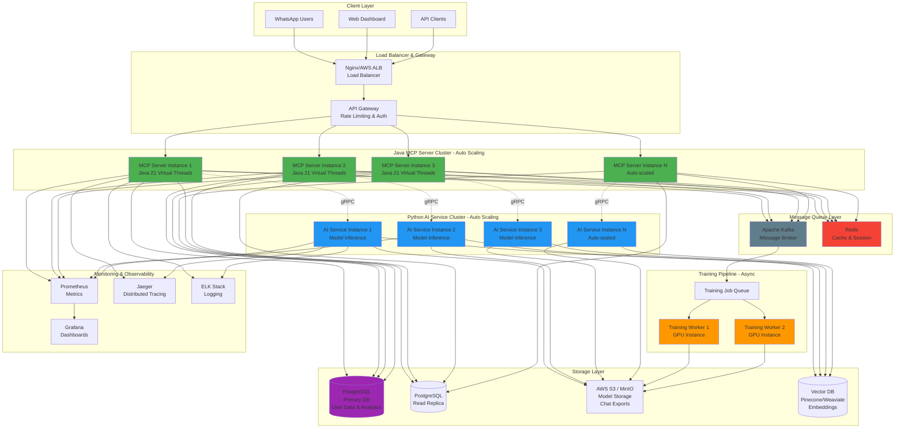
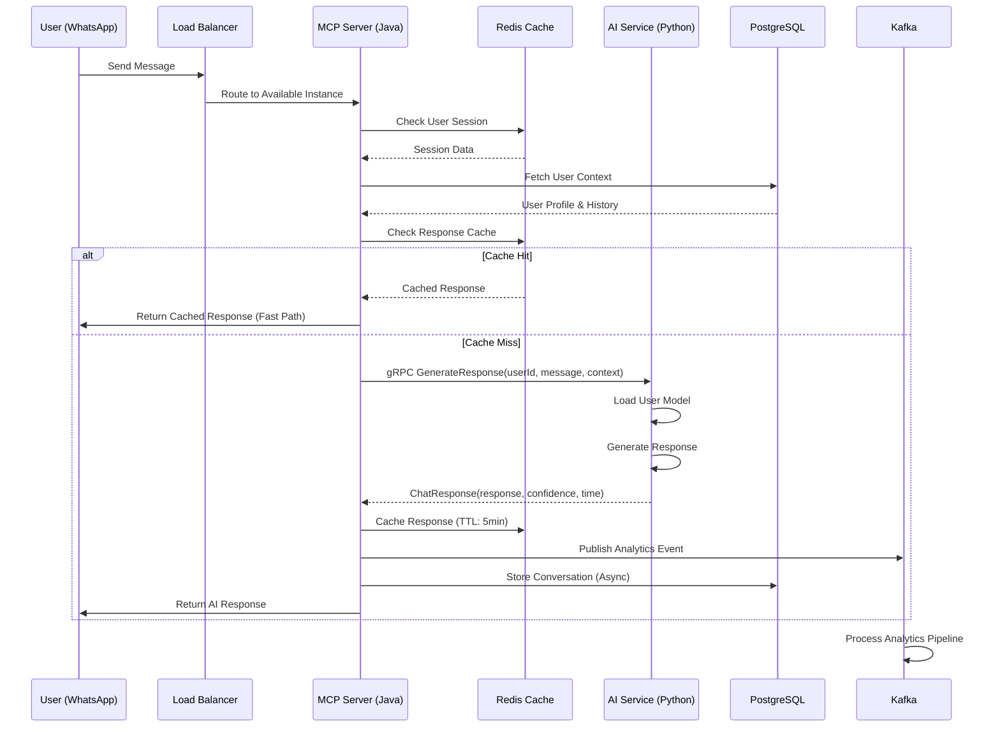

# System Design

### High-Level System Architecture

```mermaid
graph TB
    subgraph "Client Layer"
        WA[WhatsApp Users]
        WEB[Web Dashboard]
        API_CLIENT[API Clients]
    end

    subgraph "Load Balancer & Gateway"
        LB[Nginx/AWS ALB<br/>Load Balancer]
        AG[API Gateway<br/>Rate Limiting & Auth]
    end

    subgraph "Java MCP Server Cluster - Auto Scaling"
        MCP1[MCP Server Instance 1<br/>Java 21 Virtual Threads]
        MCP2[MCP Server Instance 2<br/>Java 21 Virtual Threads]
        MCP3[MCP Server Instance 3<br/>Java 21 Virtual Threads]
        MCPN[MCP Server Instance N<br/>Auto-scaled]
    end

    subgraph "Message Queue Layer"
        KAFKA[Apache Kafka<br/>Message Broker]
        REDIS[Redis<br/>Cache & Session]
    end

    subgraph "Python AI Service Cluster - Auto Scaling"
        AI1[AI Service Instance 1<br/>Model Inference]
        AI2[AI Service Instance 2<br/>Model Inference]
        AI3[AI Service Instance 3<br/>Model Inference]
        AIN[AI Service Instance N<br/>Auto-scaled]
    end

    subgraph "Storage Layer"
        PG[(PostgreSQL<br/>Primary DB<br/>User Data & Analytics)]
        PG_REPLICA[(PostgreSQL<br/>Read Replica)]
        S3[AWS S3 / MinIO<br/>Model Storage<br/>Chat Exports]
        VECTOR[(Vector DB<br/>Pinecone/Weaviate<br/>Embeddings)]
    end

    subgraph "Training Pipeline - Async"
        TRAIN_QUEUE[Training Job Queue]
        TRAIN1[Training Worker 1<br/>GPU Instance]
        TRAIN2[Training Worker 2<br/>GPU Instance]
    end

    subgraph "Monitoring & Observability"
        PROM[Prometheus<br/>Metrics]
        GRAF[Grafana<br/>Dashboards]
        JAEGER[Jaeger<br/>Distributed Tracing]
        ELK[ELK Stack<br/>Logging]
    end

    WA --> LB
    WEB --> LB
    API_CLIENT --> LB
    
    LB --> AG
    AG --> MCP1
    AG --> MCP2
    AG --> MCP3
    AG --> MCPN

    MCP1 -.gRPC.-> AI1
    MCP2 -.gRPC.-> AI2
    MCP3 -.gRPC.-> AI3
    MCPN -.gRPC.-> AIN

    MCP1 --> KAFKA
    MCP2 --> KAFKA
    MCP3 --> KAFKA
    MCPN --> KAFKA

    MCP1 --> REDIS
    MCP2 --> REDIS
    MCP3 --> REDIS
    MCPN --> REDIS

    MCP1 --> PG
    MCP2 --> PG
    MCP3 --> PG
    MCPN --> PG

    MCP1 --> PG_REPLICA
    MCP2 --> PG_REPLICA
    MCP3 --> PG_REPLICA
    MCPN --> PG_REPLICA

    AI1 --> S3
    AI2 --> S3
    AI3 --> S3
    AIN --> S3

    AI1 --> VECTOR
    AI2 --> VECTOR
    AI3 --> VECTOR
    AIN --> VECTOR

    KAFKA --> TRAIN_QUEUE
    TRAIN_QUEUE --> TRAIN1
    TRAIN_QUEUE --> TRAIN2

    TRAIN1 --> S3
    TRAIN2 --> S3

    MCP1 --> PROM
    MCP2 --> PROM
    MCP3 --> PROM
    AI1 --> PROM
    AI2 --> PROM

    PROM --> GRAF
    
    MCP1 --> JAEGER
    AI1 --> JAEGER
    
    MCP1 --> ELK
    AI1 --> ELK

    style MCP1 fill:#4CAF50
    style MCP2 fill:#4CAF50
    style MCP3 fill:#4CAF50
    style MCPN fill:#4CAF50
    
    style AI1 fill:#2196F3
    style AI2 fill:#2196F3
    style AI3 fill:#2196F3
    style AIN fill:#2196F3
    
    style TRAIN1 fill:#FF9800
    style TRAIN2 fill:#FF9800
    
    style PG fill:#9C27B0
    style REDIS fill:#F44336
    style KAFKA fill:#607D8B
```

### Chat Message Flow

```mermaid
sequenceDiagram
    participant U as User (WhatsApp)
    participant LB as Load Balancer
    participant MCP as MCP Server (Java)
    participant R as Redis Cache
    participant AI as AI Service (Python)
    participant DB as PostgreSQL
    participant K as Kafka

    U->>LB: Send Message
    LB->>MCP: Route to Available Instance
    
    MCP->>R: Check User Session
    R-->>MCP: Session Data
    
    MCP->>DB: Fetch User Context
    DB-->>MCP: User Profile & History
    
    MCP->>R: Check Response Cache
    alt Cache Hit
        R-->>MCP: Cached Response
        MCP->>U: Return Cached Response (Fast Path)
    else Cache Miss
        MCP->>AI: gRPC GenerateResponse(userId, message, context)
        
        AI->>AI: Load User Model
        AI->>AI: Generate Response
        
        AI-->>MCP: ChatResponse(response, confidence, time)
        
        MCP->>R: Cache Response (TTL: 5min)
        MCP->>K: Publish Analytics Event
        MCP->>DB: Store Conversation (Async)
        
        MCP->>U: Return AI Response
    end
    
    K->>K: Process Analytics Pipeline
```
