# System Design

### High-Level System Architecture

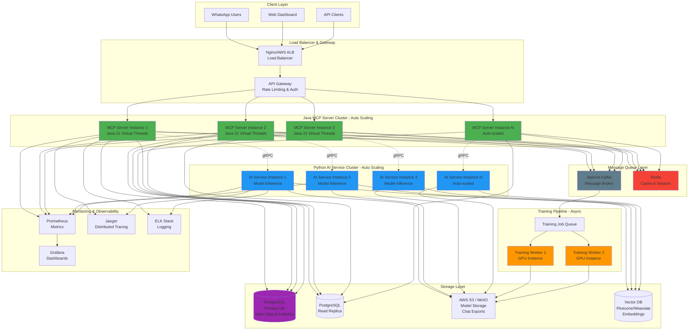

### Chat Message Flow

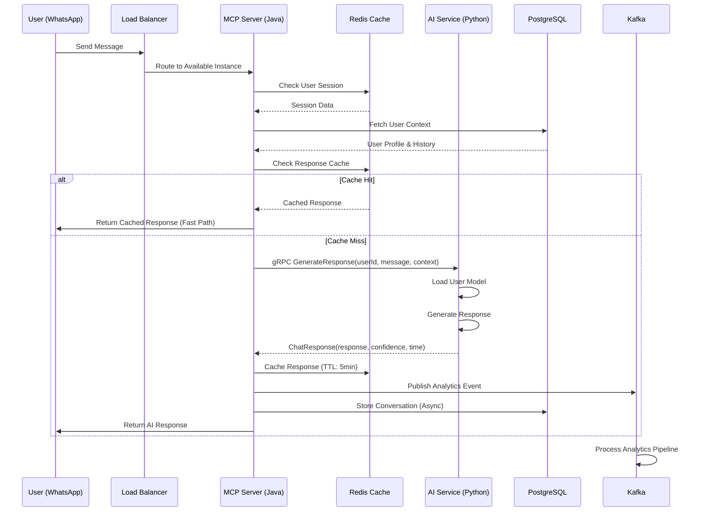

### Training Flow
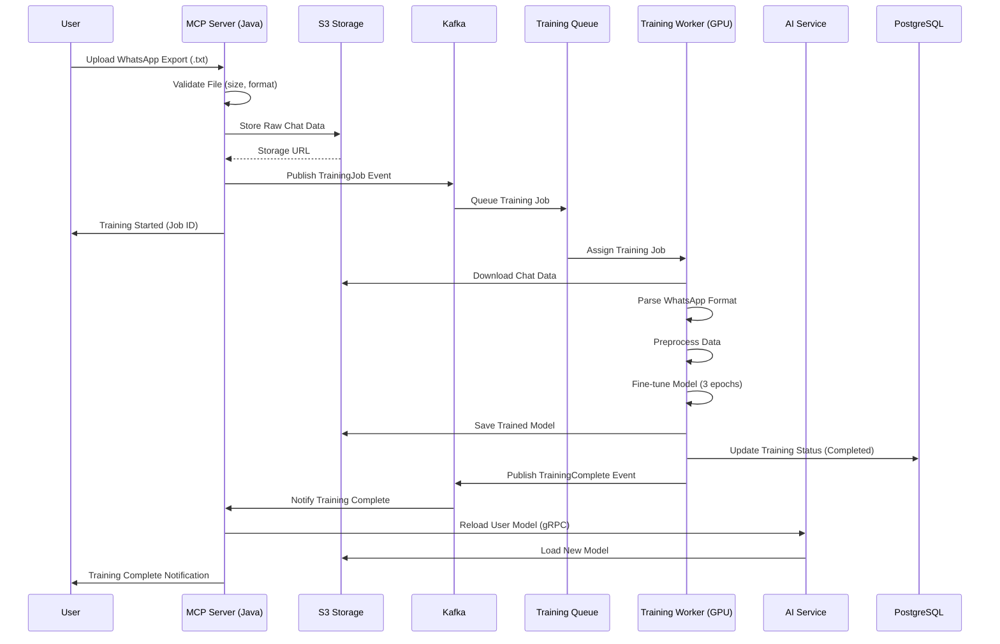

###  High Concurrency Scenario
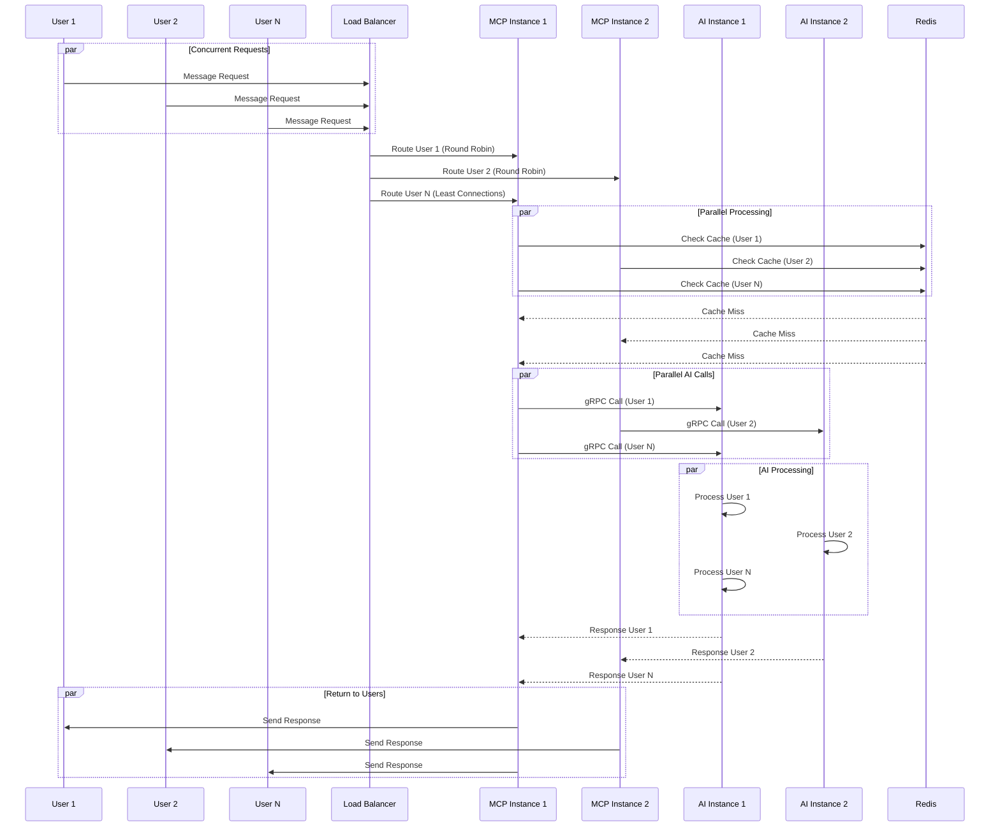

### Component Diagram
```
graph TB
    subgraph "MCP Server - Java 21"
        REST[REST Controllers<br/>@RestController]
        SERVICE[Service Layer<br/>Business Logic]
        GRPC_CLIENT[gRPC Client<br/>AIServiceStub]
        CACHE[Cache Manager<br/>Redis Operations]
        REPO[Repository Layer<br/>JPA/JDBC]
        ANALYTICS[Analytics Service<br/>Metrics Collection]
    end
    
    subgraph "AI Service - Python"
        GRPC_SERVER[gRPC Server<br/>AIServiceServicer]
        CHAT_SVC[Chat Service<br/>Inference Logic]
        TRAIN_SVC[Training Service<br/>Model Training]
        MODEL_MGR[Model Manager<br/>Model Loading/Caching]
        PARSER[WhatsApp Parser<br/>Data Preprocessing]
    end
    
    REST --> SERVICE
    SERVICE --> GRPC_CLIENT
    SERVICE --> CACHE
    SERVICE --> REPO
    SERVICE --> ANALYTICS
    
    GRPC_CLIENT -.gRPC.-> GRPC_SERVER
    
    GRPC_SERVER --> CHAT_SVC
    GRPC_SERVER --> TRAIN_SVC
    CHAT_SVC --> MODEL_MGR
    TRAIN_SVC --> MODEL_MGR
    TRAIN_SVC --> PARSER
    
    style REST fill:#4CAF50
    style GRPC_SERVER fill:#2196F3
    style MODEL_MGR fill:#FF9800
```

### Deployment Diagram
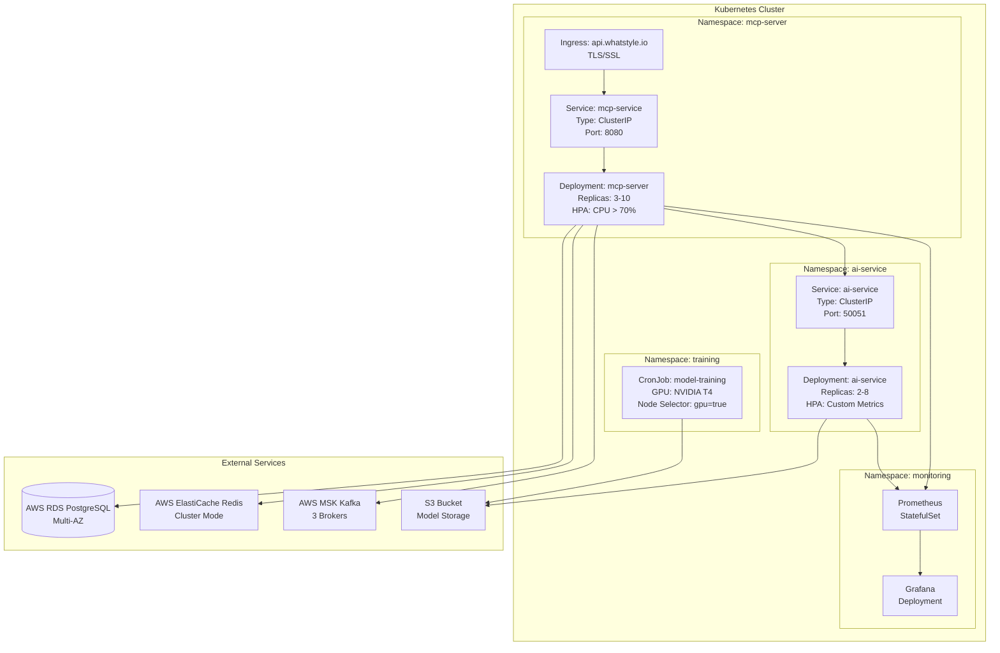

### Data Flow Diagram
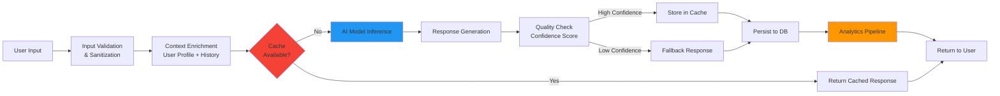

### Auto-Scaling Strategy
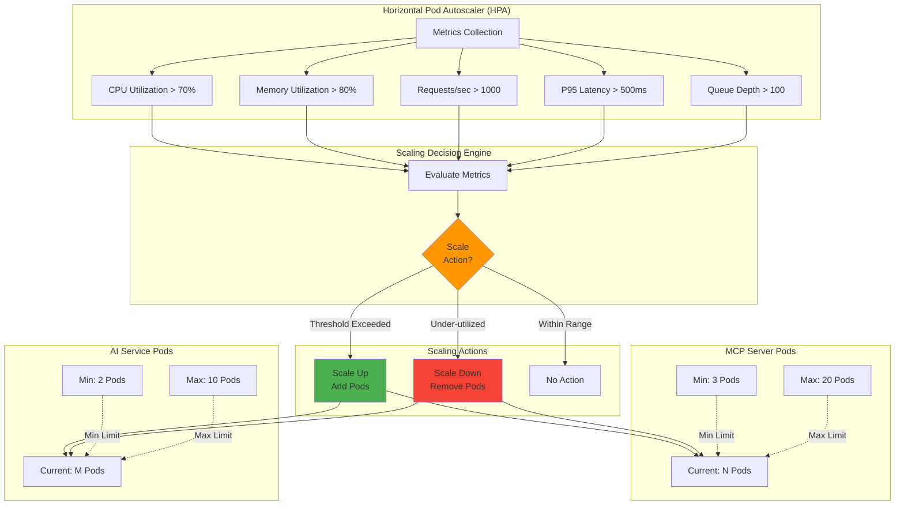

### Database Schema (ERD)
```
erDiagram
    USERS ||--o{ CONVERSATIONS : has
    USERS ||--o{ TRAINING_JOBS : requests
    USERS ||--o{ ANALYTICS_EVENTS : generates
    
    USERS {
        varchar user_id PK
        varchar phone_number UK
        timestamp created_at
        timestamp last_active
        varchar model_version
        varchar subscription_tier
        boolean is_active
    }
    
    CONVERSATIONS {
        bigint conversation_id PK
        varchar user_id FK
        text message
        text response
        float confidence
        int processing_time_ms
        timestamp created_at
        varchar model_version
    }
    
    TRAINING_JOBS {
        varchar job_id PK
        varchar user_id FK
        varchar status
        int samples_processed
        timestamp started_at
        timestamp completed_at
        text error_message
        varchar s3_data_path
    }
    
    ANALYTICS_EVENTS {
        bigint event_id PK
        varchar user_id FK
        varchar event_type
        jsonb event_data
        timestamp created_at
    }
    
    API_KEYS {
        varchar key_id PK
        varchar hashed_key UK
        varchar client_name
        int rate_limit
        boolean is_active
        timestamp created_at
        timestamp expires_at
    }
```

### Infrastructure Deployment
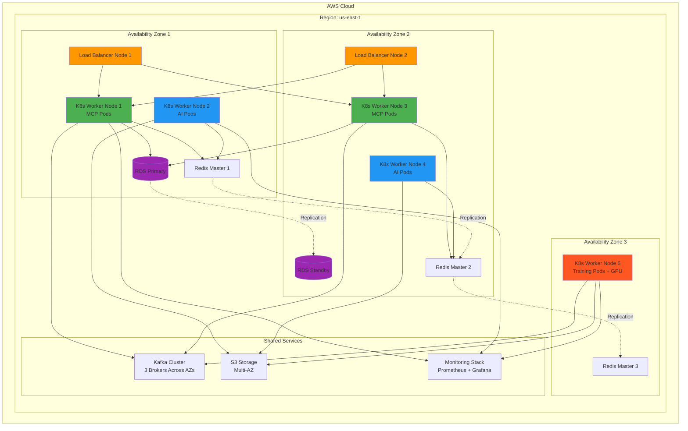
### Network Architecture
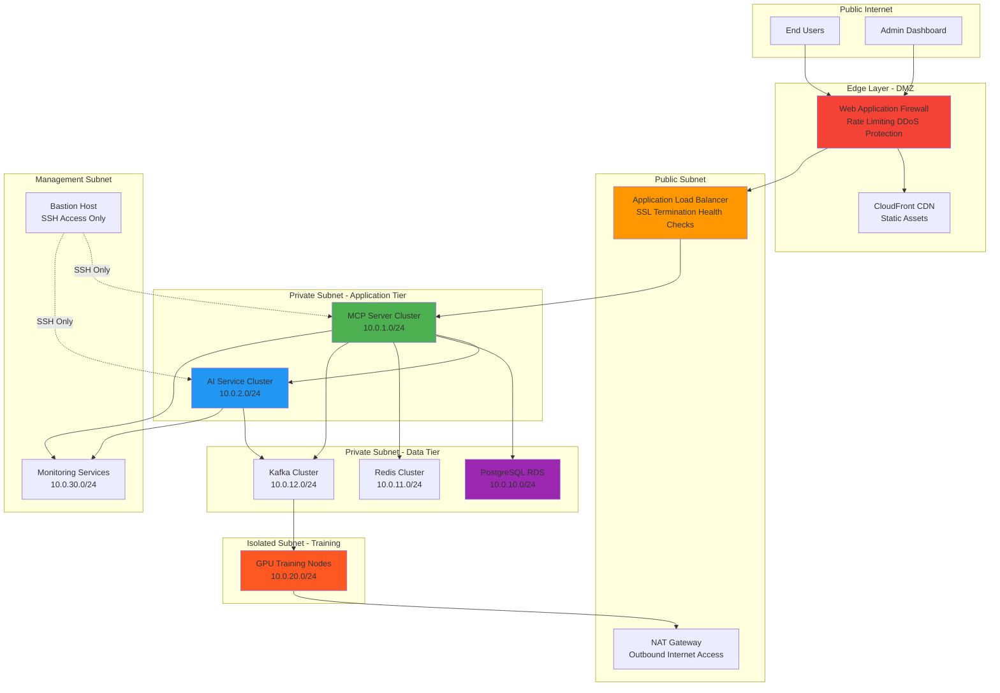

### Security Architecture
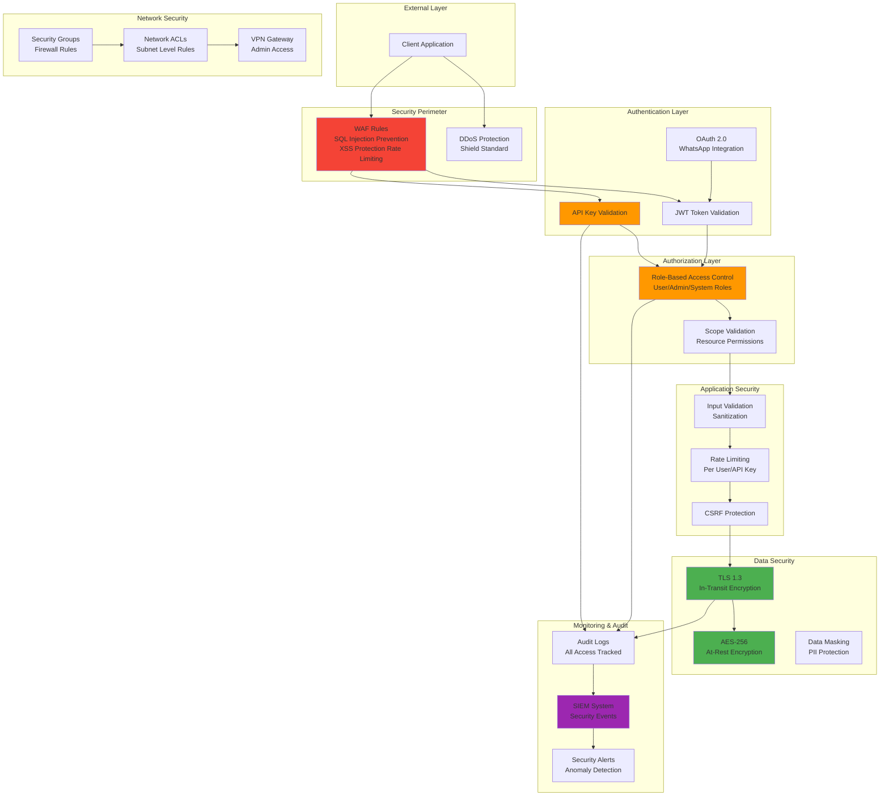

### Monitoring & Observability
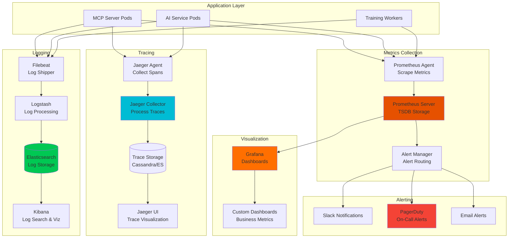
